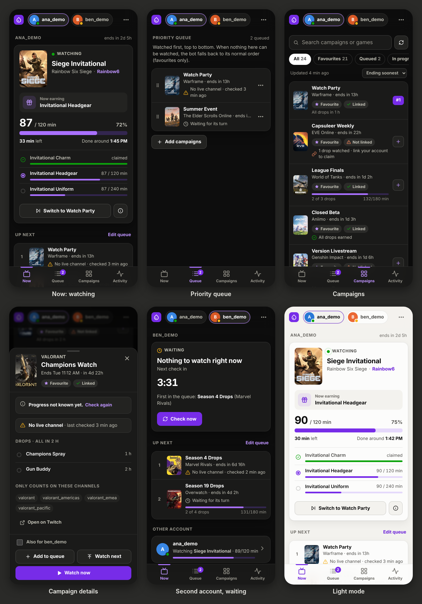
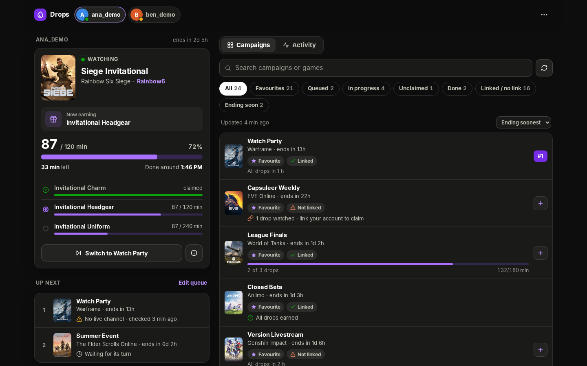
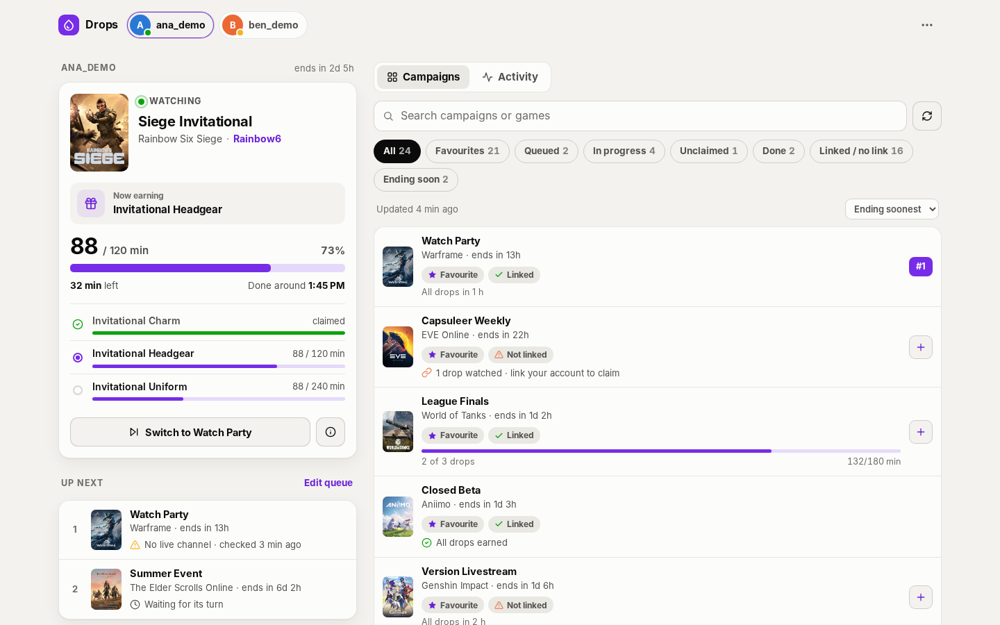
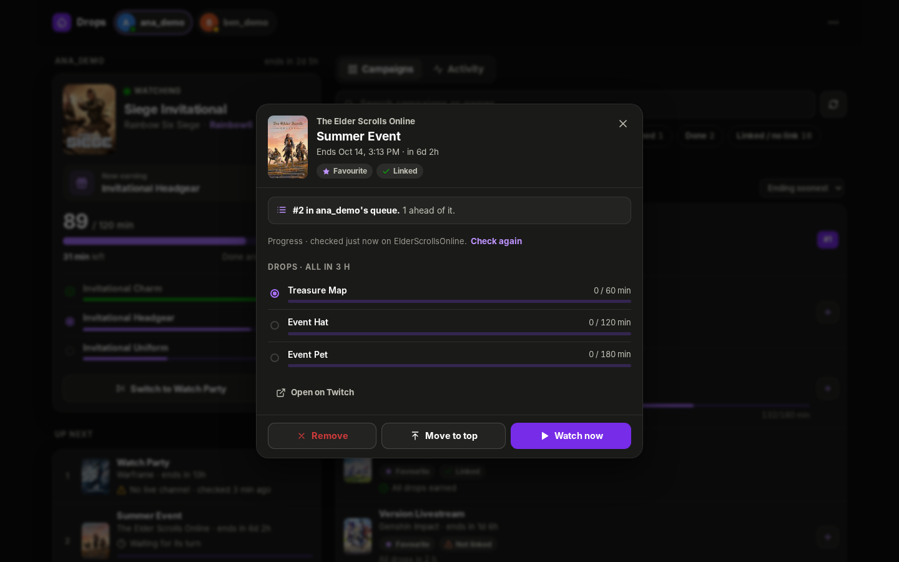

# Web UI

An optional web interface for the console bot, hosted inside the same process. For each account it shows what the bot is watching and how far each drop has got, lets you queue campaigns to watch before the normal order, and streams the bot's log. It works on phones and desktops and can be added to a phone's home screen.

It is off unless `WEBUI_ENABLED=true` is set; while it is off the console app behaves exactly as before.

Screenshots with made-up data (`WEBUI_DEMO=true`):









## Turning it on

| Variable | Meaning |
|---|---|
| `WEBUI_ENABLED` | `true` turns the web UI on. Off when unset. |
| `WEBUI_PORT` | Port to listen on. Defaults to `8080`. |
| `WEBUI_PASSWORD` | Password for the login page. |
| `WEBUI_PASSWORD_FILE` | Alternative to `WEBUI_PASSWORD`: a file holding the password, such as a Docker secret. |
| `WEBUI_AUTH=none` | Run without a login. Only for a port nobody else can reach. |
| `WEBUI_TRUSTED_PROXIES` | Comma-separated addresses of reverse proxies whose `X-Forwarded-For` and `X-Forwarded-Proto` headers are trusted. |
| `WEBUI_DATA_DIR` | Where the web UI keeps its own files (see below). Defaults to the directory of `config.json`; set it to run with `config.json` mounted read-only. |
| `WEBUI_DEMO=true` | Serve made-up accounts and campaigns instead of running the bots, for working on the page without Twitch credentials. Implies `WEBUI_ENABLED`. |

Without a password, and without `WEBUI_AUTH=none`, the web UI refuses to start and logs why. The bots run regardless.

Docker Compose example:

```yaml
services:
  twitchdropsbot:
    image: ghcr.io/<owner>/twitchdropsbot:<tag>
    environment:
      WEBUI_ENABLED: "true"
      WEBUI_PASSWORD_FILE: /run/secrets/webui_password
    ports:
      - "8080:8080"
    volumes:
      - ./config:/app/Configuration
```

The image is based on `mcr.microsoft.com/dotnet/aspnet:8.0`, because the console app now carries ASP.NET Core.

## What it does

- **Now**: per account, the campaign being watched, the channel, minutes against the drop's requirement, an estimate of when it finishes, and every drop of the campaign. When the bot is between cycles it shows why and counts down to the next check.
- **Queue**: campaigns to watch first, top to bottom, per account. Drag to reorder, or use the menu. **Watch now** moves a campaign to the top and interrupts the current watch. **Watch next** moves it to the top without interrupting. The bot re-picks at the end of every drop anyway, so a queue change takes effect by then at the latest. A queued campaign is farmed even when favourites-only mode would skip its game, and even when it is on `AvoidCampaign`. A queued campaign the bot can't watch right now (no live channel, not enough time left, subscriber-only, already done) is passed over, and the page says why.
- **Campaigns**: every campaign Twitch offers the account, with filters, link status, favourites and where the account stands: all drops earned, watched but not yet claimed (for example because the game account isn't linked), in progress, or not started. Tap one for its drops, the channels it counts on, and the queue actions.
- **Activity**: the account's log lines.

Reward campaigns (game-less Collections are dropped by the bot anyway) can't be queued.

### How it knows a campaign's progress

Twitch's inventory only lists campaigns that are under way, and drops a campaign once every drop is claimed; its list of claimed drops only holds the most recent ones. So for a campaign the bot isn't watching and the inventory doesn't list, the web UI asks Twitch for the account's progress on a live channel that carries the campaign, the same request the Twitch player makes. It does this when you open a campaign (at most every five minutes, or now with **Check again**), and in the background, one campaign every 25 seconds, queued campaigns first, then favourite games; each campaign is checked again after three hours. Campaigns found finished are remembered in `status.json`. A campaign with no live channel shows its progress as not known yet.

## Files

In `WEBUI_DATA_DIR`, or next to `config.json` when that isn't set:

- `queue.json`: the queues, keyed by Twitch user ID. It is rewritten atomically on every change.
- `status.json`: campaigns each account has finished, so a restart doesn't forget them. Entries go a day after the campaign ends.
- `webui-keys/`: the keys that sign the login cookie, so a restart doesn't sign you out.

The web UI never writes `config.json`, and no API response contains tokens, the webhook URL or other settings. Credentials that can turn up inside exception messages or log lines are masked before they are shown: user and password in URLs, `token` and `sig` query values, and webhook paths. Reward codes stay visible, since they are yours to redeem.

## Security

- Run it on your own network. Put it behind a reverse proxy with HTTPS (and set `WEBUI_TRUSTED_PROXIES`), and don't publish it to the internet.
- The login cookie is `HttpOnly` and `SameSite=Strict` and lasts 30 days. After ten failed logins in 15 minutes, an address has to wait.
- Every request that changes something must carry the `X-TDB-Request` header, which other sites can't add. The pages are served with a strict Content Security Policy and no inline script.

## API

All endpoints return JSON and, apart from the first three, need a login.

| Method | Path | |
|---|---|---|
| GET | `/healthz` | `ok`, for health checks |
| GET | `/api/session` | whether you are signed in |
| POST | `/api/login`, `/api/logout` | sign in and out |
| GET | `/api/state` | every account's status, current watch and queue |
| GET | `/api/events` | the same state as server-sent events, pushed on every change |
| GET | `/api/accounts/{id}/campaigns` | the account's campaigns |
| POST | `/api/accounts/{id}/campaigns/refresh` | fetch the list from Twitch now (at most once a minute) |
| GET | `/api/accounts/{id}/campaigns/{campaignId}?recheck=true` | one campaign with its drops; `recheck` asks Twitch for the progress again |
| POST | `/api/accounts/{id}/queue` | `{campaignId, position: "top" \| "bottom" \| index, switchNow}` |
| PUT | `/api/accounts/{id}/queue` | `{campaignIds}`: the whole queue in its new order |
| DELETE | `/api/accounts/{id}/queue/{campaignId}` | remove from the queue |
| POST | `/api/accounts/{id}/switch` | make the bot pick its campaign again now |
| GET | `/api/accounts/{id}/logs?after={seq}` | recent log lines |

`{id}` is the Twitch user ID or the login.

## Working on it

```sh
dotnet build TwitchDropsBot.Console -c Release
cd TwitchDropsBot.Console/bin/Release/net8.0
WEBUI_DEMO=true WEBUI_AUTH=none dotnet TwitchDropsBot.Console.dll
```

The page is plain HTML, CSS and JavaScript in `wwwroot`, embedded into the assembly. There is no build step.

## Changes outside this project

The web UI needs a few hooks in the bot, kept small so upstream changes rebase cleanly:

- `Core/.../Shared/Bots/BaseBot.cs`: a fresh `CancellationTokenSource` per cycle, so a re-pick can end a watch or a wait (this also makes the desktop apps' Reload buttons work), plus `NextCycleAt`, `IdleReason` and `LastError`.
- `Core/.../Shared/Bots/BotUser.cs`: those properties and `RequestReselect()`.
- `Core/.../Twitch/Bot/TwitchBot.cs`: queued campaigns go first and skip the favourites-only, linked-account and avoid filters; the campaign list is kept for the UI; skipped campaigns are noted; favourites are read live each cycle, so editing them no longer needs a restart. Campaigns that need no account link (Twitch reports them unconnected, with a link to twitch.tv itself) are claimed and pass `OnlyConnectedAccounts`.
- `Core/.../Twitch/Bot/TwitchUser.cs`: the state the UI reads; publishing a new campaign list raises `PropertyChanged`, so the UI can note box art before the bot re-fetches games.
- `Core/.../Shared/Serilog/UISink.cs`: an extra event carrying the whole log event, so the UI can render it.
- `Core/.../Shared/Factories`, `ServiceCollectionExtension.cs`: the queue service and the account registry.
- `Console/Program.cs`, `Start.cs`, `Dockerfile`, `.csproj`: host the web UI, attach the log sink, and switch to the ASP.NET base image.

New files: `Core/.../Shared/Services/CampaignQueueService.cs`, `BotRegistry.cs`, `Core/.../Shared/Bots/BotIdleReason.cs`, `Core/.../Twitch/Bot/CampaignQueueOrdering.cs` and `Core/.../Twitch/Models/Partials/DropCampaign.Links.cs`.
